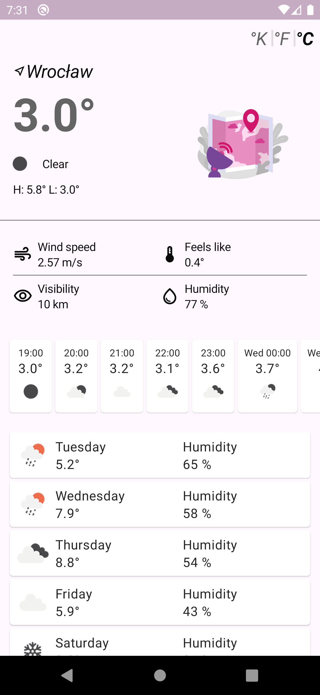
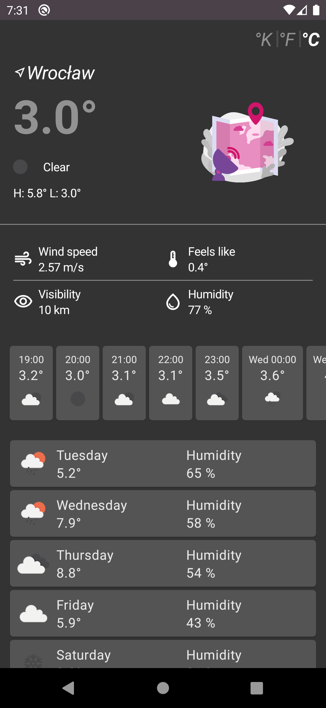

## Weather API

Application uses OpenWeatherMap API as a data service. The number of free calls is satisfying for limited usage (1000 calls per day).
The implementation presents results delivered on 'onecall' endpoint:

https://openweathermap.org/api/one-call-api

## Used architecture

MVVM - it follows the separation of concerns principle which makes it testable and clean.
 
View (MainActivity, Composable) - ViewModel (MainViewModel) - Model (RemoteDataSource, PreferenceDataSource)

## Screenshots

## Libraries used in the project
- Retrofit2 with Moshi converter - implementation of API calls with mapping adapters for JSON to Kotlin conversion
- Jetpack: ViewModel, Lifecycle, Compose, DataStore
- Hilt - dependency injection
- Glide - loading images
- Lottie - simple animations
- Timber - logging

 

## Lottie animations in the app
https://lottiefiles.com/9329-loading  
https://lottiefiles.com/92530-error-hide-and-seek  
https://lottiefiles.com/77075-location-weather-radar

## License 
https://lottiefiles.com/page/license
 
